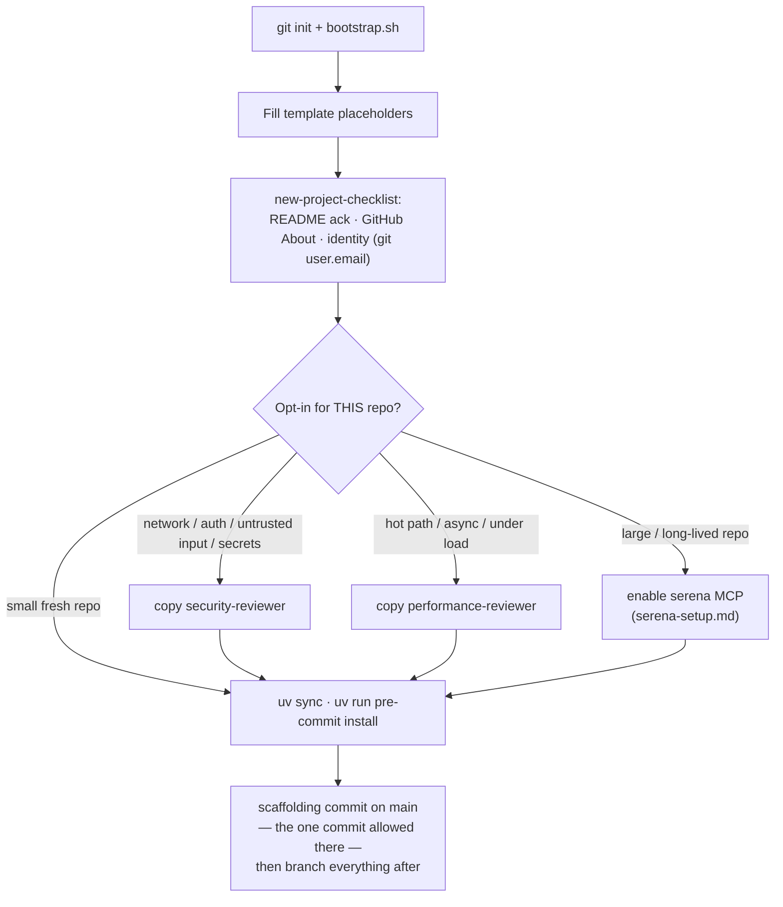
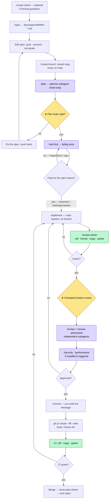
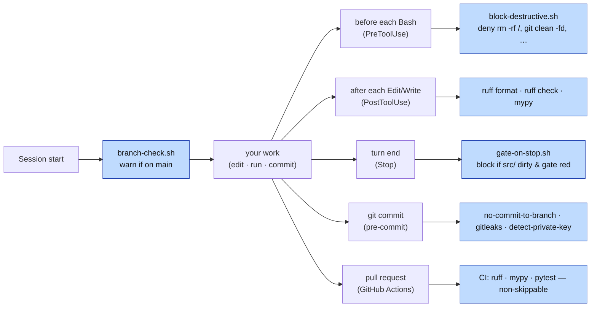
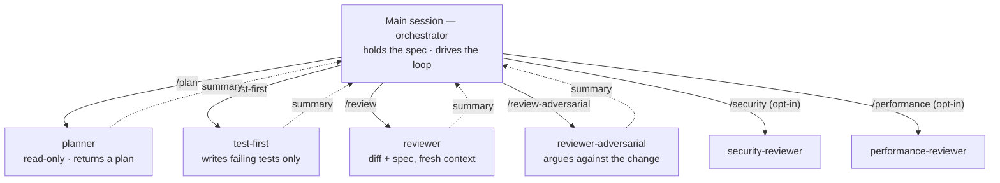
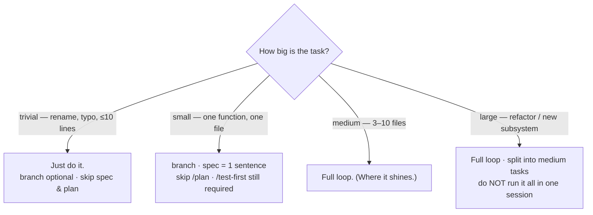
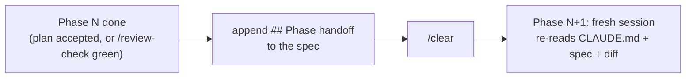

# Agentic workflow — visual map

> **Purpose.** The visual / systems companion to the methodology.
> `../CLAUDE.md` is the *rules* the agent follows every turn;
> [`../WORKFLOW.md`](../WORKFLOW.md) is the prose *walkthrough* — what each
> step is for and where it goes wrong if you skip it. This file is the
> *map*: how the spec, branch, slash commands, subagents, hooks, and CI
> fit together, in diagrams. Read WORKFLOW.md for the *why*; read this to
> see the *shape*.
>
> Diagrams are [Mermaid](https://mermaid.js.org/) — they render natively on
> GitHub and in Obsidian (VS Code needs the "Markdown Preview Mermaid
> Support" extension), and degrade to readable source everywhere else. This
> doc is generic scaffolding; nothing here is project-specific.

---

## Three actors

The loop has three actors, and most of the design is about keeping them in
their lanes:

- **You** — drive the loop, own the two checkpoints, write the spec and
  the commit message. The agent never commits for you.
- **The agent** (main session) — the *orchestrator*: holds the spec, runs
  each phase, delegates focused work to subagents to keep its own context
  clean.
- **Automation** — hooks and CI that fire on their own (on edit, on
  turn-end, on commit, on PR) so discipline doesn't depend on memory.

The diagrams below colour these where it helps: **★ checkpoints** are
yours, **gates** are automated, **subagents** run in fresh context.

---

## Day zero (once per project)

The identity check is load-bearing: `git config user.email` is baked into
the first commit forever and leaks once the repo flips public. Opt-ins are
decided *now*, not retroactively — see [`../WORKFLOW.md`](../WORKFLOW.md)
"Day zero."

---

## The per-feature loop

The core. Each box is a separate turn; the agent stops and surfaces output
at transitions rather than rolling forward.

**The two ★ checkpoints are the whole point of "autodrive."** When handed
a spec, the agent runs branch → `/test-first` → implement → `/review-check`
on its own, stopping only at: (1) after `/plan`, before tests, and (2)
after `/review-check` is green, before review/commit. A wrong turn at the
spec is a one-paragraph fix; the same error caught at review is a redo.

The back-edges matter: a failing gate or a rejected review returns to
**Implement**, not to the start — but a *wrong plan* returns to the
**spec**, because the plan being wrong usually means the spec was.

---

## The automation layer (fires on its own)

The linear loop above hides the guardrails firing around it. These need no
slash command — they trigger on lifecycle events so "I forgot to run the
gate" stops being a failure mode.

Behaviour, edge cases, and how to bypass each (e.g. the Stop hook stepping
aside on a second attempt, `--no-verify` for the day-zero commit) live in
`../CLAUDE.md` → **Hooks**. The line `block-destructive` draws is
*unrecoverable* — things the reflog or a re-clone can't bring back; merely
risky-but-recoverable commands stay off it.

---

## Orchestration model (why subagents)

The main session delegates for two reasons — **independence** (a reviewer
that already saw the implementation reasoning isn't independent) and
**context hygiene** (verbose work doesn't pollute the context holding the
goal). Subagents don't share memory with the main session; only their
summary returns.

Anything you want the reviewer to know goes in the **spec**, not a message
to the main session — the reviewer never sees the chat. Auto-invoked
*skills* (`python-module-split`, `python-docstrings`, `dependency-hygiene`)
are a separate mechanism: they load on what the diff contains, not on a
command.

---

## Scale the loop to the task

Heavyweight process on trivial work is its own failure mode. Pick the path
by size:

A change that would touch **> 5 files** is a stop-and-ask, not a
proceed-anyway — see `../CLAUDE.md` "Your role: orchestrator."

---

## Multi-day: phase handoff

Single-session features run the loop end-to-end. When a feature spans
sessions, running it all in one context degrades review quality (the
U-curve). Reset at a phase boundary instead:

The two boundaries worth a `/clear`: after `/plan` is accepted (before
`/test-first`), and after `/review-check` passes (before `/review`).
Section shapes are in [`specs/README.md`](specs/README.md).

---

## Go deeper

- [`../WORKFLOW.md`](../WORKFLOW.md) — the prose walkthrough and the
  "where it goes wrong if you skip steps" failure modes.
- `../CLAUDE.md` — the rules the agent reads every turn (delegation
  tables, Git workflow, Hooks, public-repo hygiene).
- [`specs/README.md`](specs/README.md) — spec numbering, status vocabulary,
  `## External references`, `## Phase handoff`, `## Implementation Notes`.
- [`serena-setup.md`](serena-setup.md) — the optional symbol-navigation MCP.
- Methodology background (Obsidian vault):
  `Research/Programming/Agentic Programming/02 Agentic Methodology Loop.md`
  and `01 Context Management for Coding Agents.md`.
